# Thymeleaf Companion for VS Code

**The missing Thymeleaf extension for Spring Boot apps.**

Bring Thymeleaf-aware editing to your Spring Boot templates with Java-backed completion, navigation, diagnostics, and refactoring in Visual Studio Code.

## In action

### Completion and Java-backed symbols

<div align="center">

  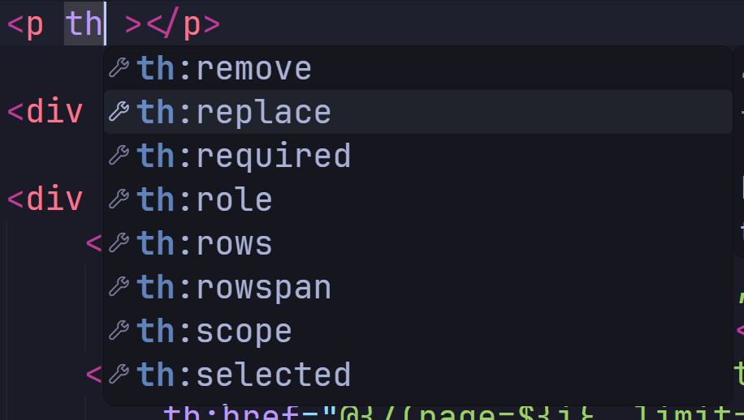
  <br/>
  <br/>
  <br/>
  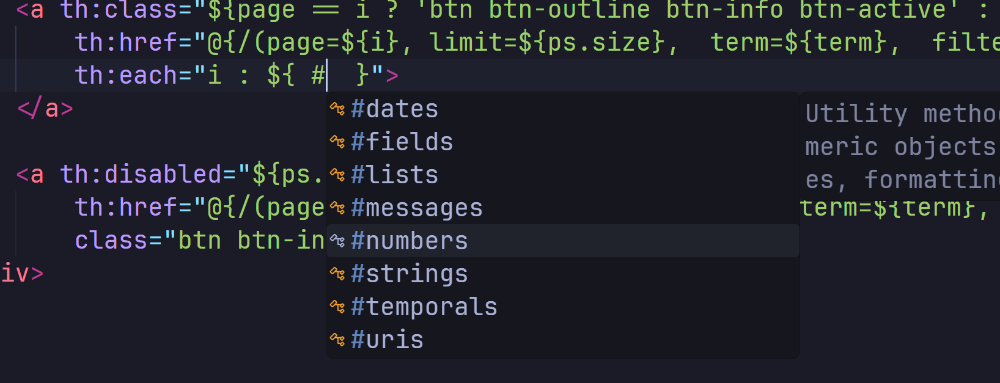
  <br/>
  <br/>
  <br/>
  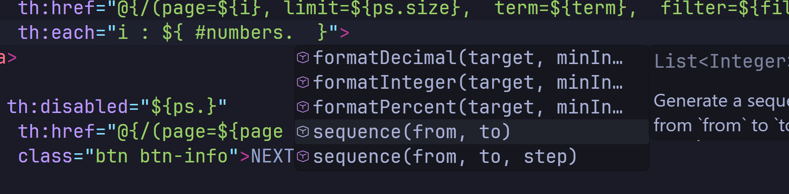
  <br/>
  <br/>
  <br/>
  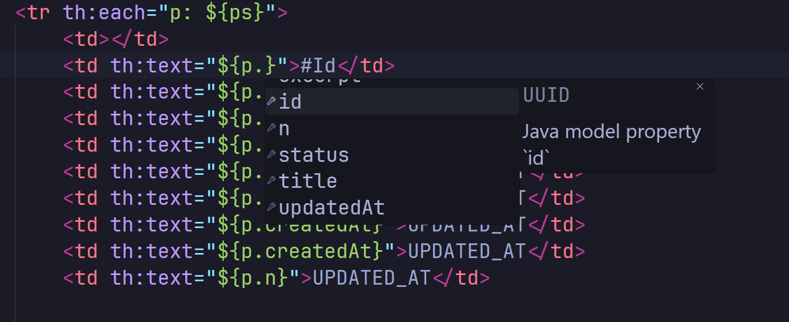
  <br/>
  <br/>
  <br/>
  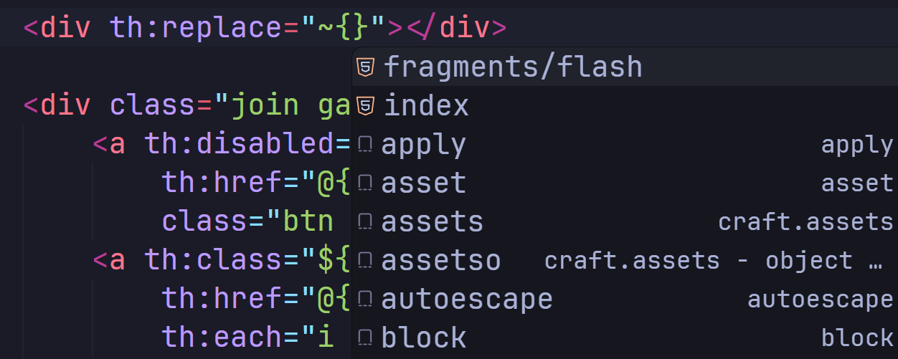
  <br/>
  <br/>
  <br/>

  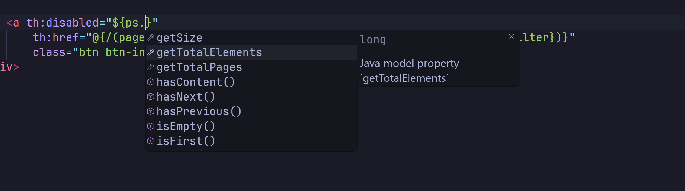
  <br/>
  <br/>
  <br/>
</div>

### Navigation between Java and templates

<div align="center">
  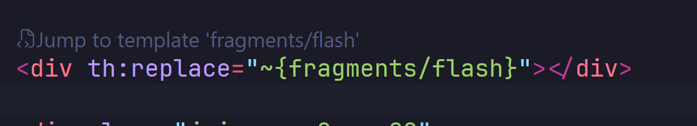
  <br/>
  <br/>
  <br/>
  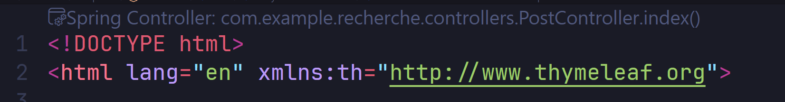
  <br/>
  <br/>
  <br/>
  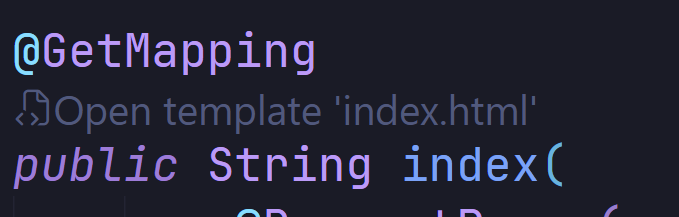
  <br/>
  <br/>
  <br/>
  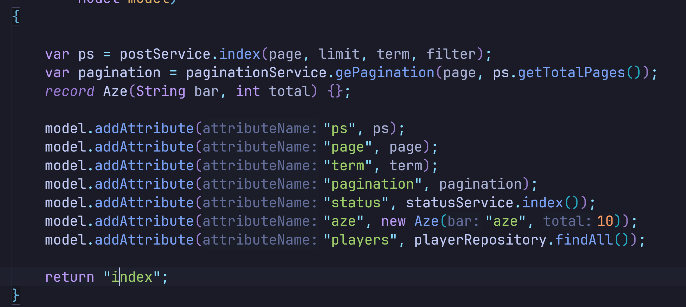
  <br/>
  <br/>
  <br/>
</div>

### Diagnostics and quick fixes

<div align="center">
  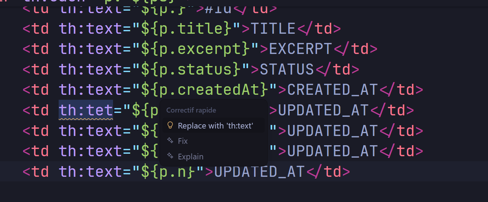
</div>

Screenshots are hosted in the repository and are not included in the extension package.

## Features

- Prioritized completion for HTML and Thymeleaf attributes, model and selection expressions, `th:each` variables, templates, fragments, controller routes, and message keys.
- Contextual completion for `th:*` attributes after whitespace, including precise replacement of partial prefixes, plus Java properties and no-argument methods inherited from indexed classes and interfaces.
- Go to Definition for Java model properties and methods, controller routes, view names, templates, and fragments; Go to Type Definition for resolvable model variables and properties.
- Rename Java model fields and record components together with Java references and matching Thymeleaf property references.
- Diagnostics for malformed expressions, unknown Thymeleaf attributes, missing templates, fragments and routes, and unresolved model properties.
- Quick fixes for missing expression braces, common attribute misspellings, and likely model-property typos.
- Code lenses and gutter markers for navigating between Spring controller handlers, templates, and Thymeleaf fragments.
- Hover documentation for resolved Java-backed model properties and methods; references for model properties and routes; semantic coloring for Java-backed model members.
- Thymeleaf syntax highlighting and optional snippets in HTML files.
- Support for both standard `th:*` attributes and their HTML5 `data-th-*` equivalents, including completion, navigation, diagnostics, and syntax highlighting.

## Requirements

- Visual Studio Code `1.85.0` or later.
- A Java project using Spring MVC / Spring Boot.
- The [Extension Pack for Java](https://marketplace.visualstudio.com/items?itemName=vscjava.vscode-java-pack), which provides the required `redhat.java` language server.

The Java language server's standard mode provides compiler and classpath-backed symbol resolution. If that API is unavailable, source-based Thymeleaf support remains available and the fallback is reported in the **Thymeleaf Companion: Java** output channel.

## Getting started

1. Install **Thymeleaf Companion** and the Extension Pack for Java.
2. Open your Spring Boot workspace in VS Code.
3. Open an HTML template under `src/main/resources/templates`.
4. Use completion, Go to Definition, diagnostics, or Rename as you edit.

Thymeleaf template paths are relative to the configured template directories and omit the `.html` extension. For example, `~{fragments/header :: navigation}` resolves to `fragments/header.html`.

## Settings

| Setting | Default | Description |
| --- | --- | --- |
| `thymeleaf.templateLocations` | `["src/main/resources/templates"]` | Template directories relative to each workspace folder. |
| `thymeleaf.validation.unclosedExpressions` | `true` | Report malformed or unclosed Thymeleaf expressions. |
| `thymeleaf.validation.unknownAttributes` | `true` | Report unknown Thymeleaf attributes and suggest close matches. |
| `thymeleaf.validation.unknownModelProperties` | `true` | Check properties when the model type can be resolved from Java sources. |

## Java and Spring support

The extension indexes common Spring MVC `@Controller` and `@RestController` mappings, static view-name returns, model values supplied through `Model.addAttribute`, `@ModelAttribute`, and Java fields, getters, and record components. It infers model types from direct service or repository calls, chained calls, and local variables declared with `var` when their initializer is a supported literal, collection factory such as `List.of` or `Arrays.asList`, or a resolvable static factory method such as `Instant.now()`. It follows generic types inherited through classes and interfaces when those types are available from project sources or the Java language server. It follows common collection types and simple generic types, including nested controller types. A `th:each` variable is available throughout its element, including in attributes written before `th:each` in the same opening tag.

With the Java language server active, external Java and JDK types are resolved through JDTLS definitions and document symbols against the imported project's classpath. Those symbols can contribute to completion, diagnostics, type navigation, method navigation (including inherited interface methods), and semantic coloring. Rename combines Java references from the Java language server with resolved Thymeleaf property and source-method references. Rename is not offered for dependency/library methods. Duplicate template names or Java simple type names across workspace roots are kept indexed but are not resolved arbitrarily by name.

The Spring handler and model association still uses source-based analysis. Java source indexing is refreshed when files are saved; with VS Code Auto Save enabled, changes are indexed automatically as they are saved. Full compiler-grade analysis of Spring runtime behavior, complex generic bounds, dynamic mappings, overloaded methods, and complete SpEL is not yet supported. Ambiguous model attributes are left unresolved rather than assigned an arbitrary Java type. Message bundles support Java `.properties` separators, escaped keys/values, Unicode escapes, and continued lines.

## Development

```sh
npm install
npm test
```

Press `F5` in VS Code to launch the Extension Development Host. `npm run compile` type-checks and bundles the extension; `npm run watch` rebuilds the bundles while editing.

## License

This project is licensed under the [MIT License](./LICENSE).

## Links

- [Source code](https://github.com/Houssam-OUATMANI/thymeleaf-vscode-extension)
- [Issues and feature requests](https://github.com/Houssam-OUATMANI/thymeleaf-vscode-extension/issues)
- [Changelog](./CHANGELOG.md)
